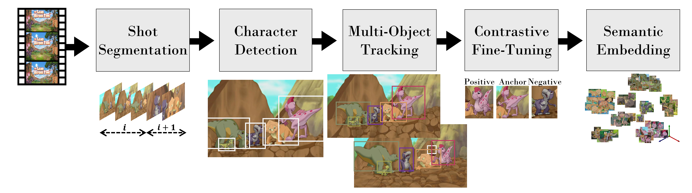

# CAST: Character labeling in Animation using Self-supervision by Tracking 
## (Published as a conference paper at EuroGraphics 2022)
Note: The CAST paper code, evaluation dataset, and models are to be stored here soon.
Authors: Oron Nir, Gal Rapoport, and Ariel Shamir
All technical details are available on [the paper](https://arxiv.org/abs/2201.07619).

For more details reach out to oronnir11 at gmail dot com

[Watch the demo video!](https://www.youtube.com/embed/PsfNiIBwH1w)

## Abstract
Cartoons and animation domain videos have very different characteristics compared to real-life images and videos. In addition, this domain carries a large variability in styles. Current computer vision and deep-learning solutions often fail on animated content because they were trained on natural images. In this paper we present a method to refine a semantic representation suitable for specific animated content. We first train a neural network on a large-scale set of animation videos and use the mapping to deep features as an embedding space. Next, we use self-supervision to refine the representation for any specific animation style by gathering many examples of animated characters in this style, using a multi-object tracking. These examples are used to define triplets for contrastive loss training.
The refined semantic space allows better clustering of animated characters even when they have diverse manifestations. Using this space we can build dictionaries of characters in an animation videos, and define specialized classifiers for specific stylistic content (e.g., characters in a specific animation series) with very little user effort. These classifiers are the basis for automatically labeling characters in animation videos. We present results on a collection of characters in a variety of animation styles.

The pipeline below illustrates the major components. These steps are available in the E2E scripts. 


#Supported E2E flows:
Here are the corresponding endpoint scripts (Python 3.7.9).
~~~
1. main_1.py Input: mp4, output: triplets (Windows).
   1.1. Split the video to shots.
   1.2. Sample frames.
   1.3. Run detector and vanilla embeddings.
   1.4. Run a Multi-Object Tracker per shot.
   1.5. Sample triplets. 
2. tuner_data_preper_2.py and anchor_triplets_json_2.py (Windows).
   2.1. Generate triplets with corresponding images for finetune.
   2.2. Prepare the JSON file with the bounding boxes to later embed using the finetuned model. 
3. fine_tune_series_3.py Triplets contrastive finetune (Linux).
   3.1. Run the finetune flow.
   3.2. Use the tuned model to better embed the bounding boxes.
4. cluster_4.py Grouping (Windows).
   4.1. Cluster the embedded boxes and find the cluster center/exemplar.
   4.2. Visualize with collages.

Other evaluation and visualization scripts that were developed towards EuroGraphics submission are also provided here.
~~~
#Citation
Please cite our paper with the following bibtex:
```
@misc{nir2022cast,
      title={CAST: Character labeling in Animation using Self-supervision by Tracking}, 
      author={Oron Nir and Gal Rapoport and Ariel Shamir},
      year={2022},
      eprint={2201.07619},
      archivePrefix={arXiv},
      primaryClass={cs.CV}
}
```
